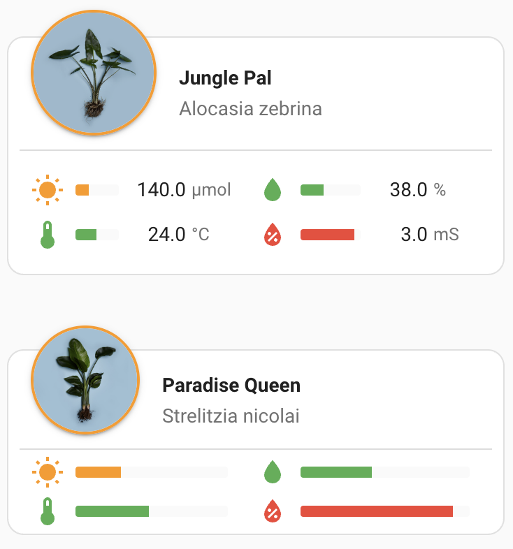

# Home Assistant Fyta Plant Card

A custom card for displaying [FYTA plant](https://fyta.de/) information on your Home Assistant dashboard.



## Prerequisites

- [FYTA integration](https://www.home-assistant.io/integrations/fyta/) must be installed and configured in Home Assistant

## Features

- Displays plant image, name, and health status
- Shows sensor values with color-coded status indicators
- Customizable sensor display (moisture, light, temperature, nutrition, salinity)
- Interactive elements - click any sensor to view detailed data
- Battery status indicator with configurable threshold
- Compact display mode for smaller dashboards

## Installation

### HACS Installation (Recommended)

1. Add this repository as a custom repository in HACS:
   - Go to HACS → Frontend
   - Click the three dots in the top right corner
   - Select "Custom repositories"
   - Add `FYTA-GmbH/fyta-plant-card` with category "Lovelace"
2. Install "FYTA Plant Card" from HACS
3. Refresh your browser

### Manual Installation

1. Download `fyta-plant-card.js` from the `dist` folder in this repository
2. Copy it to your `config/www` directory
3. Add the resource in your dashboard:
   - Go to your dashboard
   - Click "Edit Dashboard" → "Manage Resources"
   - Add `/local/fyta-plant-card.js` as a JavaScript module
4. Refresh your browser

## Configuration

The card includes a visual editor for easy configuration. For manual YAML configuration, use these options:

| Name                 | Type    | Description                                         | Default      |
|----------------------|---------|-----------------------------------------------------|--------------|
| type                 | string  | `custom:fyta-plant-card`                            | (required)   |
| device_id            | string  | Device ID of the Fyta plant                         | (required)   |
| title                | string  | Card title                                          | Plant name   |
| display_mode         | string  | `full` or `compact`                                 | `full`       |
| battery_threshold    | number  | Battery level (%) at which icon appears (0-100)     | `30`         |
| show_scientific_name | boolean | Show light sensor                                   | `true`       |
| state_color_battery  | boolean | Expose battery state in color of battery icon       | `true`       |
| state_color_icon     | boolean | Expose sensor state in color of sensor icons        | `true`       |
| state_color_plant    | string  | `image`, `name`, or `disabled`                      | `image`      |
| state_color_sensor   | boolean | Expose sensor state in color of sensor bars         | `true`       |
| sensor               | boolean | Array of sensor information                         | See sensors  |


### Sensors
Sensors is a YAML array that set the order of sensors and whether they are enabled. Each entry consists of a type (`light`, `moisture`, `temperature`, `salinity`, or `nutrients`) and its state `isEnabled`.

### Battery Display

Set `battery_threshold` to control when the battery icon appears:
- `0`: Never show the battery icon
- `30` (default): Show only when battery is 30% or below
- `100`: Always show the battery icon
- Any value in between: Show when battery level is at or below this percentage

## Example Configuration

```yaml
type: custom:fyta-plant-card
device_id: 12345abc67890def123456
title: My Monstera
display_mode: compact
battery_threshold: 30
show_scientific_name: true
state_color_battery: true
state_color_icon: true
state_color_plant: image
state_color_sensor: true
sensor:
  - type: light
    isEnabled: true
  - type: moisture
    isEnabled: true
  - type: temperature
    isEnabled: true
  - type: nutrients
    isEnabled: true
  - type: salinity
    isEnabled: false
```

## Video Tutorial

For a visual guide on installation and configuration:

[](https://youtu.be/KS1u91yYSsE)

## Troubleshooting

- Make sure your FYTA integration is properly set up with connected plants
- Verify your plant's device ID is correct
- Check browser console for any error messages
- If card does not appear after installation, clear your browser cache

## License

This project is licensed under the GNU General Public License v3.0 (GPL-3.0).
