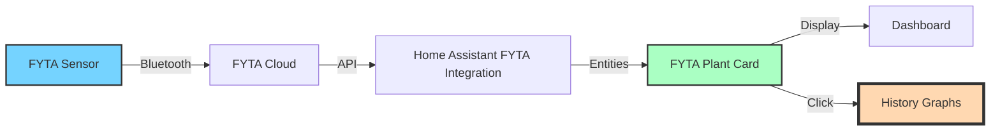
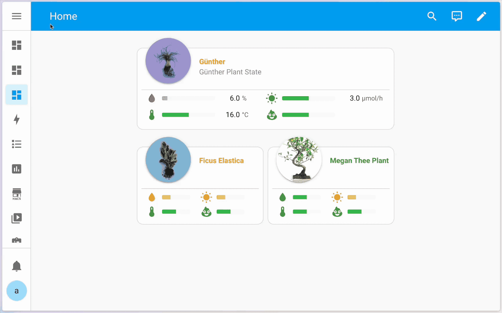

# HomeAssistant Fyta Plant Card
Custom card to display information of [Fyta plants](https://fyta.de/) on your Home Assistant dashboard.

You will need the [Fyta integration](https://www.home-assistant.io/integrations/fyta/) installed to use this card.


## Features

- Displays your plant's image and health status
- Shows sensor values for moisture, light, temperature, and fertilizer/conductivity
- Interactive tooltips showing status and current values
- Colored meters indicating the current state (too low, low, perfect, high, too high)
- Click on any sensor value to view historical time series data and trends
- Click on any element to see detailed history graphs
- Battery status indicator that only appears when battery is low (below 10%)
- Customizable sensor display order with dropdown selection
- Compact display mode for smaller dashboards

## How It Works



The FYTA Plant Card displays data from the FYTA integration in Home Assistant, showing:
- Current sensor readings (moisture, light, temperature, conductivity)
- Plant status with color-coded indicators
- Interactive elements that show detailed information when clicked

### HomeAssistant Integration

This card requires the official [Home Assistant FYTA integration](https://www.home-assistant.io/integrations/fyta/). For more information about FYTA, please refer to the [FYTA GitHub page](https://github.com/FYTA-GmbH) or the [FYTA webpage](https://www.fyta.de).

## Installation

1. Download `fyta-plant-card.js` from the [latest release](https://github.com/dontinelli/fyta-plant-card/releases).
2. Using the File editor add-on, create the `config/www` folder if it doesn't exist yet, and upload the file to this folder.
3. Ensure you have advanced mode enabled (accessible via your username in the bottom left corner)
4. Go to any dashboard where you have edit rights, click on "Edit" in the top right corner, then click the three dots menu and select "Manage resources".
5. Add `/local/fyta-plant-card.js` with type JS module.
6. Refresh the page or restart Home Assistant for the card to appear in your dashboard. If the card doesn't appear, try clearing your browser cache.

### Video Installation Guide

Please note that while the card has been updated since this video was created, the basic installation procedure remains the same. For a visual guide on how to install and configure the card, check out this video tutorial:

[](https://youtu.be/KS1u91yYSsE)

## Usage

After adding the card to your dashboard, you can:
- Click on the plant name or image to see detailed plant information
- Click on any sensor to see its historical data graph
- Hover over sensors to see tooltips with detailed status information
- Battery indicator only appears when battery level is below 10%



### Status Indicators

The card uses color-coded indicators to show the status of each measurement:
- 🟢 **Green**: Perfect condition
- 🟡 **Yellow**: High or Low (needs attention)
- 🔴 **Red**: Too High or Too Low (critical - immediate attention needed)
- ⚪ **Gray**: No data available

## Configuration Options

The custom card comes with a visual card editor, which facilitates the selection of the desired Fyta plant and configuration of display options.

For configuration in YAML mode, the following parameters are available:

| Name              | Type    | Requirement  | Description                                            | Default     |
| ----------------- | ------- | ------------ | ------------------------------------------------------ | ----------- |
| type              | string  | **Required** | `custom:fyta-plant-card`                               | -           |
| device_id         | string  | **Required** | Device ID of the plant in Home Assistant               | -           |
| title             | string  | **Optional** | Card title (by default this will be the plant name)    | Plant name  |
| display_mode      | string  | **Optional** | Display mode: `full` or `compact`                      | `full`      |
| show_light        | boolean | **Optional** | Show light status                                      | `true`      |
| light_order       | string  | **Optional** | Display order for light sensor (1-5)                   | `2`         |
| show_moisture     | boolean | **Optional** | Show moisture status                                   | `true`      |
| moisture_order    | string  | **Optional** | Display order for moisture sensor (1-5)                | `1`         |
| show_temperature  | boolean | **Optional** | Show temperature status                                | `true`      |
| temperature_order | string  | **Optional** | Display order for temperature sensor (1-5)             | `3`         |
| show_nutrition    | boolean | **Optional** | Show nutrition status                                  | `true`      |
| nutrition_order   | string  | **Optional** | Display order for nutrition sensor (1-5)               | `4`         |
| show_salinity     | boolean | **Optional** | Show salinity status                                   | `false`     |
| salinity_order    | string  | **Optional** | Display order for salinity sensor (1-5)                | `5`         |

### Display Order

The card allows you to customize the order in which sensors are displayed. Sensors are arranged based on their order value (1-5). When there's an odd number of visible sensors, the sensor with the highest order number will appear full-width at the bottom of the card.

By default, the sensors are ordered as follows:
1. Moisture (water)
2. Light
3. Temperature
4. Nutrition
5. Salinity (hidden by default)

### Battery Display

The battery indicator only appears when the battery level is below 10%, displaying in red to indicate that attention is needed.

## Example Configuration

```yaml
type: 'custom:fyta-plant-card'
device_id: 12345abc67890def123456
title: My Lovely Monstera
display_mode: full
show_light: true
light_order: '2'
show_moisture: true
moisture_order: '1'
show_temperature: true
temperature_order: '3'
show_nutrition: true
nutrition_order: '4'
show_salinity: false
salinity_order: '5'
```

## Troubleshooting

If you encounter any issues with the card:

1. Make sure the Fyta integration is properly set up and your plants are connected
2. Verify that your plant's device ID is correct
3. Check the browser console for any error messages
4. Report any bugs or request features on the GitHub issues page

## Contributing

Feel free to fork the project and submit pull requests with improvements or fixes. For major changes, please open an issue first to discuss what you would like to change.

## Acknowledgements

This card was inspired by and adapted from [Olen's lovelace-flower-card](https://github.com/Olen/lovelace-flower-card). The design aesthetic, layout, and several functional aspects were based on this excellent work. Many thanks to @Olen and the contributors to that project for creating such a useful card that served as a template for this implementation.

## License

This project is licensed under the GNU General Public License v3.0 (GPL-3.0) - see the [LICENSE](LICENSE) file for details. This license ensures that all modified versions of the code remain freely available to the community. Any derivative work must also be distributed under the same license terms.
